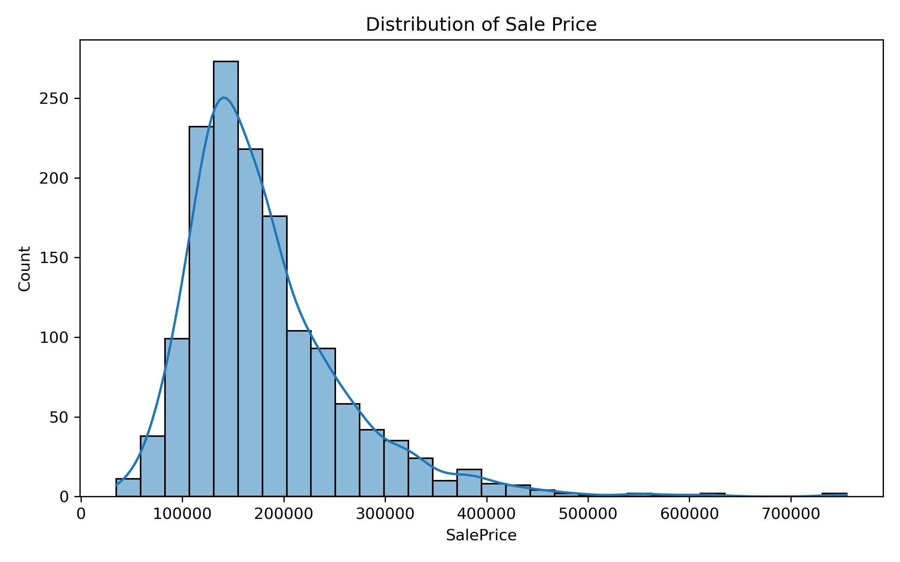
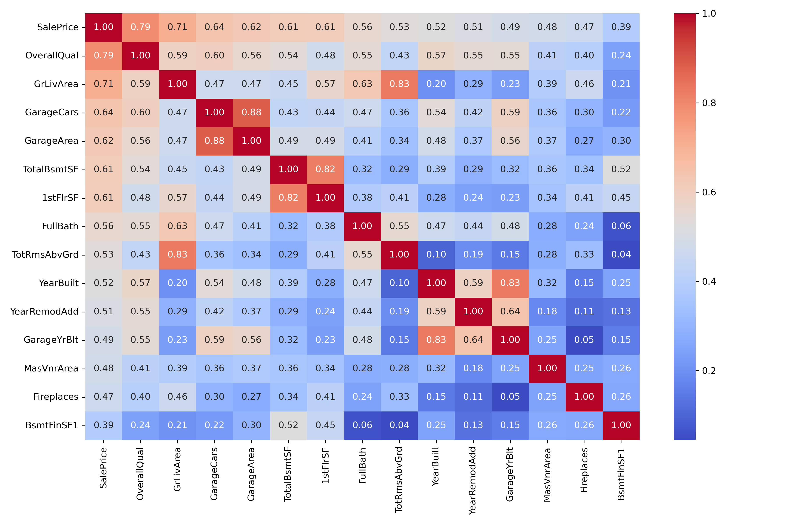
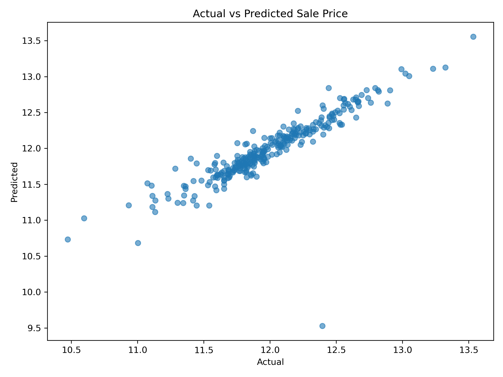
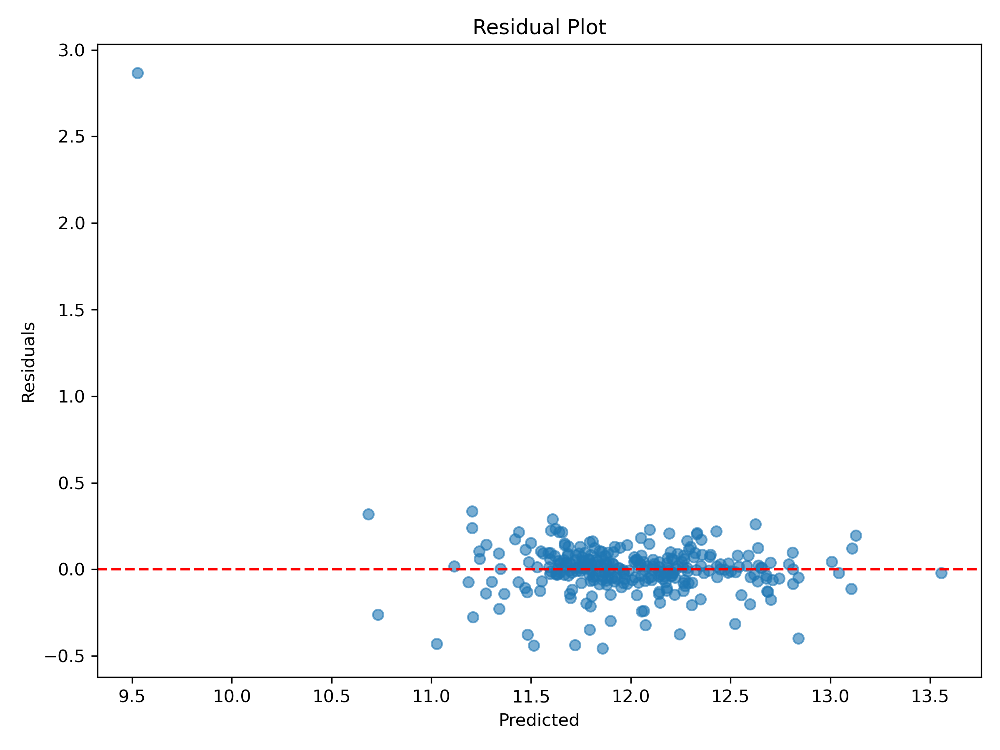

# House Price Prediction using Linear Regression

A Machine Learning project that predicts house sale prices using the Ames Housing Dataset. This project demonstrates the complete Machine Learning workflow, including data preprocessing, exploratory data analysis, feature engineering, model training, evaluation, and model deployment preparation using **Linear Regression**.

---

# Project Overview

The objective of this project is to build a Linear Regression model that predicts house sale prices based on various property features.

The project covers:

- Data Loading
- Data Exploration
- Missing Value Analysis
- Data Cleaning
- Exploratory Data Analysis (EDA)
- Feature Engineering
- Log Transformation
- One-Hot Encoding
- Model Training
- Model Evaluation
- Model Saving

---

# Project Structure

```
House_Price_Prediction/
│
├── Data/
│   ├── Housing1.csv
│   └── predictions.csv
│
├── Images/
│   ├── sale_price_distribution.png
│   ├── log_transformed_sale_price.png
│   ├── missing_values.png
│   ├── top_features_heatmap.png
│   ├── top_features_correlation.png
│   ├── overall_quality_vs_sale_price.png
│   ├── ground_living_area_vs_sale_price.png
│   ├── garage_cars_vs_sale_price.png
│   ├── year_built_vs_sale_price.png
│   ├── actual_vs_predicted_sale_price.png
│   ├── residual_plot.png
│   └── feature_importance.png
│
├── Models/
│   └── house_price_model.pkl
│
├── Notebooks/
│   └── House_pricing.ipynb
│
├── README.md
├── requirements.txt
└── .gitignore
```

---

# Dataset

**Dataset Name:** Ames Housing Dataset

The dataset contains detailed information about residential properties including:

- Lot Area
- Overall Quality
- Garage Area
- Garage Cars
- Basement Area
- Living Area
- Number of Rooms
- Year Built
- Sale Price
- and many more...

Number of Records:

- **1460 Houses**

Number of Features:

- **81 Original Features**
- **234 Features after One-Hot Encoding**

Target Variable:

- **SalePrice**

---

# Technologies Used

- Python
- Pandas
- NumPy
- Matplotlib
- Seaborn
- Scikit-learn
- Joblib
- Jupyter Notebook

---

# Exploratory Data Analysis

The following analyses were performed:

- Distribution of Sale Price
- Missing Value Analysis
- Correlation Heatmap
- Top Features Correlated with Sale Price
- Overall Quality vs Sale Price
- Ground Living Area vs Sale Price
- Garage Cars vs Sale Price
- Year Built vs Sale Price

---

# Data Preprocessing

The following preprocessing techniques were applied:

- Missing Value Handling
- Median Imputation for Numerical Features
- Mode Imputation for Categorical Features
- Log Transformation of Sale Price
- One-Hot Encoding for Categorical Variables
- Train-Test Split (80:20)

---

# Model

**Algorithm Used**

- Linear Regression

# Training

- Train Size: 80%
- Test Size: 20%
- Random State: 42

---

# Model Evaluation

The model was evaluated using:

- Mean Absolute Error (MAE)
- Root Mean Squared Error (RMSE)
- R² Score

# Results

| Metric | Value |
|---------|-------|
| MAE | 0.0977 |
| RMSE | 0.2091 |
| R² Score | 0.7658 |

The model explains approximately **76.6%** of the variance in house sale prices.

---

# Visualizations

The project includes:

- Distribution Plot
- Missing Values Plot
- Correlation Heatmap
- Feature Correlation Plot
- Scatter Plots
- Box Plots
- Actual vs Predicted Plot
- Residual Plot
- Feature Importance Plot

---


# Project Visualizations

## 1. Sale Price Distribution

Shows the distribution of house sale prices before applying the log transformation.



---

## 2. Correlation Heatmap

Displays the correlation among the most important numerical features.



---

## 3. Actual vs Predicted Sale Price

Compares the predicted house prices with the actual prices.



---

## 4. Residual Plot

Shows the distribution of residuals to evaluate model performance.



# Saved Model

The trained Linear Regression model is saved using Joblib.

```
Models/
└── house_price_model.pkl
```

It can be loaded using:

```python
import joblib

model = joblib.load("Models/house_price_model.pkl")
```

---

## 🚀 How to Run

### Clone Repository

```bash
git clone https://github.com/kindlefest08/House_Price_Prediction.git
```

### Navigate

```bash
cd House_Price_Prediction
```

### Install Dependencies

```bash
pip install -r requirements.txt
```

### Run Jupyter Notebook

```bash
jupyter notebook
```

Open:

```
Notebooks/House_pricing1.ipynb
```

---

# Future Improvements

Possible improvements include:

- Hyperparameter Tuning
- Cross Validation
- Feature Selection
- Streamlit Web Application
- Deployment using Flask or FastAPI

---

# Learning Outcomes

Through this project, I gained hands-on experience in:

- Data Cleaning
- Exploratory Data Analysis
- Feature Engineering
- Handling Missing Values
- One-Hot Encoding
- Log Transformation
- Linear Regression
- Model Evaluation
- Machine Learning Workflow
- Model Serialization using Joblib

---

# Author

**Vaishali Limbapure**

Computer Engineering Student

Machine Learning & Data Analytics Enthusiast

GitHub: http://github.com/kindlefest08


---

# Acknowledgements

- Kaggle Ames Housing Dataset
- Scikit-learn Documentation
- Pandas Documentation
- Matplotlib Documentation